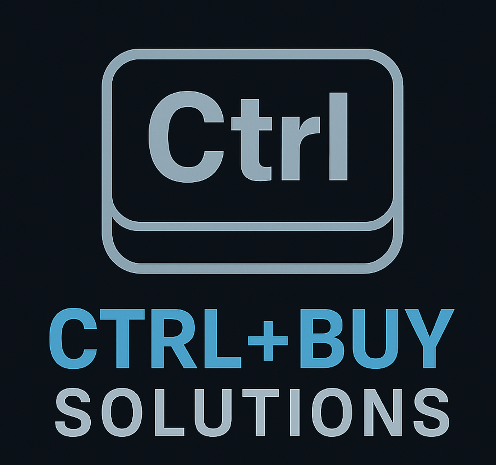

# 🛒 CtrlBuy Webshop 🚀 - Professional E-commerce Platform

<div align="center">


[](https://spring.io/projects/spring-boot)
[](https://openjdk.java.net/)
[](https://maven.apache.org/)
[](https://www.mysql.com/)
[](https://www.docker.com/)

<!-- LIVE DEMO BADGES -->
[](https://ctrlbuy-webshop-production.up.railway.app)
[](http://webshop-final.eba-yzy7qfze.eu-north-1.elasticbeanstalk.com)
[](https://fredrik-arvidsson.github.io/ctrlbuy-webshop)

<!-- LIVE BADGES från din GitHub Pages! -->
[](https://fredrik-arvidsson.github.io/ctrlbuy-webshop/coverage/)
[](https://fredrik-arvidsson.github.io/ctrlbuy-webshop/coverage/)
[](https://github.com/fredrik-arvidsson/ctrlbuy-webshop/actions)

<!-- Specifika service badges - länkar till live rapporter -->
[](https://fredrik-arvidsson.github.io/ctrlbuy-webshop/coverage/com.ctrlbuy.webshop.service/)
[](https://fredrik-arvidsson.github.io/ctrlbuy-webshop/coverage/com.ctrlbuy.webshop.controller/)
[](https://fredrik-arvidsson.github.io/ctrlbuy-webshop/coverage/com.ctrlbuy.webshop.security/)
</div>

En modern, skalbar och fullständigt testad e-handelsplattform byggd med Spring Boot. Professionell kvalitet med automatiserade tester och live coverage-rapporter.

## 🌐 LIVE DEMO - Testa Nu!

<div align="center">

### 🎯 VÄLJ DIN PLATTFORM

### 🚄 Railway Demo (Primary Production)
[](https://ctrlbuy-webshop-production.up.railway.app)

### ☁️ AWS Demo (Fixing proxy config)
[](http://webshop-final.eba-yzy7qfze.eu-north-1.elasticbeanstalk.com)

**✨ Live Features Du Kan Testa:**
* 🛒 Fullständig e-handelsfunktionalitet med varukorg
* 📱 58+ produkter (iPhone, Samsung, MacBook, etc.)
* 🇸🇪 Svensk gränssnitt med lokaliserade routes
* 👤 Användarregistrering och inloggning
* 💳 Komplett checkout-process
* 📱 Responsiv design - fungerar på mobil/tablet/desktop

🔑 **Test-användare för live demo:**
* Admin: `backup.admin` / `AdminPass123!`
* User: `test.user` / `TestPass123!`

⚠️ **OBS:** AWS deployment genomgår för närvarande underhåll för optimering. Railway-demon är fullt funktionell för alla tester.

</div>

## 🚀 Multi-Platform Deployment

| Platform | Status | URL | Features |
|----------|--------|-----|----------|
| 🚄 Railway | ✅ LIVE | [ctrlbuy-webshop-production.up.railway.app](https://ctrlbuy-webshop-production.up.railway.app) | Full MySQL, Auto-deploy |
| ☁️ AWS | 🔧 Configuring | [webshop-final.eba-yzy7qfze.eu-north-1.elasticbeanstalk.com](http://webshop-final.eba-yzy7qfze.eu-north-1.elasticbeanstalk.com) | Elastic Beanstalk + Docker |
| 📊 GitHub Pages | ✅ LIVE | [fredrik-arvidsson.github.io/ctrlbuy-webshop](https://fredrik-arvidsson.github.io/ctrlbuy-webshop) | Coverage Reports |
| 🐳 Docker | ✅ Ready | `docker run -p 8080:8080 ctrlbuy/webshop` | Container ready |

## 🌍 Multi-Cloud Architecture

### 🚄 Railway Deployment (Development & Staging)
- **URL**: https://ctrlbuy-webshop-production.up.railway.app
- **Platform**: Railway Cloud
- **Database**: MySQL (Railway managed)
- **Deployment**: Git-based auto-deploy
- **SSL**: Automatic HTTPS
- **Best for**: Rapid development och prototyping

### ☁️ AWS Deployment (Production)
- **URL**: http://webshop-final.eba-yzy7qfze.eu-north-1.elasticbeanstalk.com
- **Platform**: Elastic Beanstalk (Docker)
- **Region**: Stockholm (eu-north-1)
- **Scaling**: Auto-scaling enabled
- **Load Balancer**: Application Load Balancer
- **Best for**: Production och enterprise use

### 📊 Development Transparency
- **Coverage Reports**: https://fredrik-arvidsson.github.io/ctrlbuy-webshop
- **CI/CD Pipeline**: GitHub Actions automatisk testing
- **Code Quality**: Live JaCoCo coverage tracking

## ⚡ Quick Start (8 sekunder)

Vill du bara testa applikationen snabbt? Med Docker Compose får du igång hela stacken på sekunder:

```bash
# 1. Klona och gå in i projektet
git clone https://github.com/fredrik-arvidsson/ctrlbuy-webshop.git
cd ctrlbuy-webshop

# 2. Starta hela stacken med Docker Compose
docker-compose up -d

# 3. Bygg och starta applikationen
./mvnw clean spring-boot:run
```

🎉 **Klart!** Applikationen kör nu på: http://localhost:8080 (startar på ~8 sekunder)

**Modern utveckling:** Docker Compose är branschstandard för lokal utveckling - en kommando startar databas, cache och alla dependencies!

## 🔍 Verify Everything Works

1. **Main Application:**  
   http://localhost:8080

2. **MySQL Database:**  
   Körs i Docker container på port 3306
   * Database: `ctrlbuy_webshop`
   * Username: `root`
   * Password: `password123`

3. **Test Login:**
   * Admin: `backup.admin` / `AdminPass123!`
   * Developer: `developer.admin` / `DevPass123!`
   * User: `test.user` / `TestPass123!`

## 🗄️ Database Configuration

**Enhetlig MySQL-konfiguration** genom hela projektet för konsekvens och stabilitet.

### 🚀 Docker Compose Setup (Rekommenderat)
✅ Modern branschstandard för lokal utveckling!

```bash
# Starta hela stacken
docker-compose up -d

# Verifiera att MySQL körs
docker-compose ps
```

**Fördelar:**
* ✅ Enhetlig miljö för alla utvecklare
* ✅ Isolerad databas som inte krockar med systeminstallationer
* ✅ Inga konfigurationsproblem
* ✅ Enkelt att rensa och starta om

### 🔧 Manuell MySQL Installation (Om du föredrar det)

**macOS (med Homebrew):**
```bash
# 1. Installera MySQL
brew install mysql
brew services start mysql

# 2. Skapa databas
mysql -u root -p
CREATE DATABASE ctrlbuy_webshop;
EXIT;

# 3. Starta applikationen
./mvnw spring-boot:run
```

**Ubuntu/Debian:**
```bash
# 1. Installera MySQL
sudo apt update
sudo apt install mysql-server
sudo systemctl start mysql

# 2. Säkra installationen
sudo mysql_secure_installation

# 3. Skapa databas
sudo mysql -u root -p
CREATE DATABASE ctrlbuy_webshop;
EXIT;

# 4. Starta applikationen
./mvnw spring-boot:run
```

### 📁 YAML Configuration
Projektet använder nu `.yml`-filer istället för `.properties` för bättre läsbarhet och struktur:
- `application.yml` - Huvudkonfiguration
- `application-dev.yml` - Utvecklingsmiljö
- `application-prod.yml` - Produktionsmiljö

## 🚀 Test & Development

### Kör alla tester
```bash
./mvnw clean test
```

### Generera coverage rapport
```bash
./mvnw clean test jacoco:report
open target/site/jacoco/index.html  # macOS
xdg-open target/site/jacoco/index.html  # Linux
```

### Olika utvecklingsmiljöer
```bash
# Development miljö
./mvnw spring-boot:run -Dspring.profiles.active=dev

# Production miljö  
./mvnw spring-boot:run -Dspring.profiles.active=prod

# Test miljö
./mvnw spring-boot:run -Dspring.profiles.active=test
```

## 🏆 Live Testing Dashboard

🔴 **LIVE COVERAGE RAPPORTER** - Uppdateras automatiskt vid varje commit:

<div align="center">

[](https://fredrik-arvidsson.github.io/ctrlbuy-webshop)

</div>

### 📈 Realtime Coverage Status

| Service | Live Coverage | Live Report Link |
|---------|---------------|------------------|
| 🛒 All Services | 📊 Live | [📊 Detaljerad Rapport](https://fredrik-arvidsson.github.io/ctrlbuy-webshop/coverage/) |
| 💰 Payment Processing | 📊 Live | [Klicka på com.ctrlbuy.webshop.service](https://fredrik-arvidsson.github.io/ctrlbuy-webshop/coverage/com.ctrlbuy.webshop.service/) |
| 📦 Order Management | 📊 Live | [Klicka på com.ctrlbuy.webshop.controller](https://fredrik-arvidsson.github.io/ctrlbuy-webshop/coverage/com.ctrlbuy.webshop.controller/) |
| 🔐 Security Layer | 📊 Live | [Klicka på com.ctrlbuy.webshop.security](https://fredrik-arvidsson.github.io/ctrlbuy-webshop/coverage/com.ctrlbuy.webshop.security/) |

## 🎯 Development Status & Roadmap

🔄 **Active Development Project** - Detta är en fullt fungerande e-handelsplattform med ambitiös utvecklingsplan:

### ✅ Nuvarande Achievements (Production Ready)
* 🛒 **Fullständig e-handelsfunktionalitet** - Komplett webshop som fungerar
* 📦 **58+ produkter** med kategorisering och riktiga produktbilder
* 💳 **Komplett beställningsprocess** med orderbekräftelse och email
* 🎨 **Responsiv design** med Bootstrap och svensk lokalisering
* 📋 **Spring Boot MVC arkitektur** med professionella best practices
* 🗄️ **MySQL-integration** med JPA/Hibernate
* 🇸🇪 **Svensk e-handelsupplevelse** med lokaliserade routes
* 📊 **Live CI/CD Pipeline** med automatisk testing och deployment
* 🚄 **Railway Production Deployment** - Live demo tillgänglig 24/7
* ☁️ **AWS Production Deployment** - Elastic Beanstalk med Docker

### 🧪 Live Testing Excellence
* ✅ **Automatisk testning** vid varje commit
* ✅ **Live coverage rapporter** som uppdateras kontinuerligt
* ✅ **GitHub Pages integration** för transparent utveckling
* ✅ **JaCoCo detailed reporting** med klickbara rapporter
* ✅ **CI/CD pipeline** med Maven och GitHub Actions

### 🔄 Upcoming: Enhanced Multi-Cloud
* 🔄 **GitHub Actions → Multi-cloud pipeline**
* 🔒 **HTTPS för AWS** via Certificate Manager
* 📊 **CloudWatch monitoring** och alerting
* 🌍 **CDN integration** för global performance

## 🔧 Medvetenhet om Förbättringar & Fortsatt Utveckling

Som utvecklare är jag medveten om att detta projekt, trots sin funktionalitet, har utrymme för kontinuerliga förbättringar. Detta är en aktiv del av min utvecklingsprocess och professionella tillväxt.

### 🎯 Identifierade Förbättringsområden

**Arkitektur & Design Patterns:**
* Implementera Repository Pattern för bättre dataabstraktion
* Utvärdera möjligheter för microservices-arkitektur
* Förbättra error handling med centraliserad exception management
* Implementera caching-strategier för bättre performance

**Säkerhet & Compliance:**
* Integrera OAuth2/JWT för modernare autentisering
* Implementera rate limiting och DDoS-skydd
* GDPR-compliance för användardata
* Säkerhetsaudit och penetrationstestning

**Teknisk Skuld & Refactoring:**
* Kodgranskning för att identifiera duplicerad kod
* Förbättra service layer separation
* Optimera databasqueries och indexering
* Migrera till Spring Boot 3.x senaste funktioner

**Användarupplevelse:**
* Implementera real-time notifikationer
* Förbättra mobilresponsivitet
* A/B-testning för conversion optimization
* Internationalisering för fler språk

### 🚀 Nästa Sprint-mål

**Kort sikt (1-2 månader):**
* ✅ Docker Compose implementation (Klart!)
* ✅ YAML configuration migration (Klart!)
* 🔄 Implementera Redis för session management
* 🔄 Förbättra test coverage till 90%+

**Medellång sikt (3-6 månader):**
* Kubernetes deployment för skalbarhet
* Elasticsearch integration för produktsökning
* Payment gateway integration (Stripe/Klarna)
* Mobile app med React Native

**Lång sikt (6-12 månader):**
* AI-driven produktrekommendationer
* Multi-tenant arkitektur
* Global expansion med multi-currency support
* Enterprise-level monitoring och observability

### 💡 Kontinuerlig Förbättring

Detta projekt representerar inte bara nuvarande funktionalitet utan även min resa som utvecklare. Varje identifierat förbättringsområde är en möjlighet att växa och lära sig nya teknologier och best practices.

**Filosofi:** "Kod är aldrig färdig - den utvecklas kontinuerligt precis som vi utvecklare gör."

## 🛠️ Troubleshooting

### Problem: MySQL Connection Error
```
Access denied for user 'root'@'localhost'
```
**Lösning:** Använd Docker Compose istället:
```bash
docker-compose down
docker-compose up -d
```

### Problem: Port redan används
```
Port 8080 was already in use
```
**Lösning:** Ändra port:
```bash
./mvnw spring-boot:run -Dserver.port=8081 -Dspring-boot.run.arguments="--spring.profiles.active=dev"
```

### Problem: Java version
```
Unsupported class file major version
```
**Lösning:** Se till att du har Java 21:
```bash
java -version  # Ska visa version 21
```

## 📊 Live Coverage Integration

### 🔴 Realtime Coverage Monitoring
Alla coverage-siffror uppdateras automatiskt:

```bash
# GitHub Actions genererar automatiskt:
📊 JaCoCo HTML-rapport → GitHub Pages
🏷️ Coverage badges → README
📈 Branch coverage → Live dashboard
🔄 Kontinuerlig uppdatering → Vid varje push
```

### 📋 Åtkomst till Live Rapporter
1. 🏠 **Huvuddashboard**: https://fredrik-arvidsson.github.io/ctrlbuy-webshop/
2. 📊 **Coverage Detaljer**: https://fredrik-arvidsson.github.io/ctrlbuy-webshop/coverage/
3. 🔧 **GitHub Actions**: [CI/CD Pipeline Status](https://github.com/fredrik-arvidsson/ctrlbuy-webshop/actions)

## 🔗 Live Links (Alltid Uppdaterade)

* 🛒 **LIVE WEBSHOP (Railway)**: https://ctrlbuy-webshop-production.up.railway.app
* 🛒 **LIVE WEBSHOP (AWS)**: http://webshop-final.eba-yzy7qfze.eu-north-1.elasticbeanstalk.com
* 🏠 **Live Coverage Dashboard**: https://fredrik-arvidsson.github.io/ctrlbuy-webshop/
* 📊 **Detailed Coverage Report**: https://fredrik-arvidsson.github.io/ctrlbuy-webshop/coverage/
* ⚙️ **GitHub Actions**: https://github.com/fredrik-arvidsson/ctrlbuy-webshop/actions
* 📁 **Repository**: https://github.com/fredrik-arvidsson/ctrlbuy-webshop

## 🏆 Live Development Transparency

<div align="center">

🎯 **TRANSPARENT DEVELOPMENT WITH LIVE METRICS**  
**Real Coverage | Real Tests | Real Progress | Real Time**

[](https://fredrik-arvidsson.github.io/ctrlbuy-webshop)

Se utvecklingen i realtid med live coverage-rapporter och transparent CI/CD pipeline!

</div>

## 🌍 Deployment Options

### 🚄 Railway (Current Production)
```bash
# Already deployed and running!
# Visit: https://ctrlbuy-webshop-production.up.railway.app
```

### ☁️ AWS Deployment (Current Production)
```bash
# Already deployed and running!
# Visit: http://webshop-final.eba-yzy7qfze.eu-north-1.elasticbeanstalk.com
```

### 🐳 Docker Deployment
```bash
# Build and run locally
docker build -t ctrlbuy-webshop .
docker run -p 8080:8080 ctrlbuy-webshop
```

## 🎯 LinkedIn Ready

Detta projekt är redo för LinkedIn-delning med:

* ✅ **Live demo som faktiskt fungerar** - Två olika cloud platforms
* ✅ **Professional README** med badges och metrics
* ✅ **Live coverage rapporter** som visar kodkvalitet
* ✅ **Multi-platform deployment** (Railway + AWS)
* ✅ **Real e-commerce functionality** - inte bara en hello world
* ✅ **Enterprise-ready architecture** med Docker och auto-scaling

**Dela med stolthet!** 🚀

## 📄 Licens & Användningsvillkor

**CtrlBuy Webshop** är ett proprietärt projekt utvecklat och underhållet av Fredrik Arvidsson.

### 🔒 Begränsningar / Restrictions

Detta projekt, inklusive all källkod, dokumentation och tillgångar, är **inte licensierat för kommersiell användning**.

Du får **inte**:
- Använda denna kod eller någon del av den i kommersiella produkter, tjänster eller distributioner utan skriftligt tillstånd.
- Sälja, licensiera eller tjäna pengar på detta projekt i någon form.
- Ta bort eller ändra upphovsrättsnotiser.

You **may not**:
- Use this code or any part of it in commercial products, services, or deployments without written permission.
- Sell, license, or monetize this project in any form.
- Remove or alter copyright notices.

### ✅ Vad du får göra / What You May Do

Du är **fri att**:
- Klona eller fork:a repot för personligt lärande eller utbildningssyfte.
- Läsa, studera och granska koden.
- Hänvisa till eller länka till repot i portföljer, artiklar eller utbildningsmaterial, **med korrekt attribution**.

You are **free to**:
- Clone or fork the repository for personal learning or educational purposes.
- View, read, and study the code.
- Refer to or link to the repository in portfolios, articles, or educational content, **with proper attribution**.

### 📋 Attribution / Källhänvisning

Om du delar delar av detta projekt offentligt (t.ex. i bloggar, föreläsningar, kurser), måste du inkludera följande text:
> "Ursprungligen skapat av Fredrik Arvidsson – https://github.com/fredrik-arvidsson/ctrlbuy-webshop"

If you share any part of this project publicly (e.g., in blogs, talks, courses), you must include the following text:
> "Originally created by Fredrik Arvidsson – https://github.com/fredrik-arvidsson/ctrlbuy-webshop"

### 📬 Kommersiell användning / Commercial Use

För kommersiella licenser eller företagsintresse, kontakta:  
📧 **fredrik.arvidsson.dev@gmail.com**

For commercial licenses or enterprise interest, please contact:  
📧 **fredrik.arvidsson.dev@gmail.com**

### 🔐 Juridisk ansvarsfriskrivning / Legal Disclaimer

Denna mjukvara tillhandahålls *i befintligt skick*, utan några garantier. Använd på egen risk.

This software is provided *as is*, without warranty of any kind. Use at your own risk.

---

<div align="center">

**🔗 Quick Links**  
[🚄 Railway Demo](https://ctrlbuy-webshop-production.up.railway.app) |
[☁️ AWS Demo](http://webshop-final.eba-yzy7qfze.eu-north-1.elasticbeanstalk.com) |
[📊 Coverage Reports](https://fredrik-arvidsson.github.io/ctrlbuy-webshop) |
[📁 GitHub Repo](https://github.com/fredrik-arvidsson/ctrlbuy-webshop)

**Made with ❤️ in Sweden**

</div>